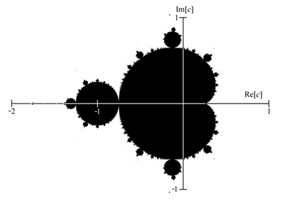
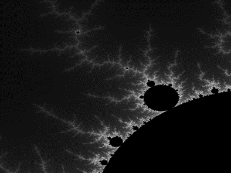

VPS5 - Exercise 3
=================

## 1. Dish of the Day: "Almondbreads"

In this exercise, we would like to take a look at a very special form of bread: the "Almondbread" or in other words the *Mandelbrot*. However, the Mandelbrot is not a common form of bread. It is very special (and delicious) and as a consequence, to bake a Mandelbrot we cannot just use normal grains. Instead, we need special or complex grains. The recipe is the following:

The Mandelbrot set is the set of complex numbers $c$, for which the following (recursive) sequence of complex numbers $z_n$

$$ z_0 = 0 $$

$$ z_{n+1} = z_n^2 + c $$

doesn't diverge towards infinity. If you are not so familiar with complex numbers (anymore), a short introduction can be found at the end of this exercise sheet.

If you mark these points of the Mandelbrot set in the complex plane, you get the very characteristic picture of the set (also called "Apfelmännchen" in German). The set occupies approximately the area from $-2-i$ to $1+i$:



To get even more interesting and artistic pictures the points outside of the Mandelbrot set can be colored differently depending on how fast the sequence diverges towards infinity. Therefore, just define an upper limit for the absolute value of $z_n$ (usually 4). If $z_n$ grows larger than this upper limit, it can be assumed that $z_n$ will keep growing and will finally diverge. On the other hand, if this upper limit is not exceeded in a predefined number of iterations (usually 10.000), it can be assumed that the sequence will not diverge and that the starting point $c$ consequently is element of the Mandelbrot set. Depending on how fast $z_n$ goes beyond the limit (number of iterations) the starting point $c$ can be colored.

**Task 1.a (4 Points):**
Write a simple generator in C# using the provided framework that calculates and displays the Mandelbrot set. Additionally, the generator should have the feature to zoom into the set. Therefore, the user should be able to draw a selection rectangle into the current picture of the set which marks the new section that should be displayed. By clicking on the right mouse button, the original picture ( $-2-i$ to $1+i$ ) should be generated again.

**Task 1.b (8 Points):**
Take care that the calculation of the points is computationally expensive. Consequently, it is reasonable to use a separate (worker) thread, so that the user interface stays reactive during the generation of a new picture. However, it can be the case that the user selects a new section before the generation of a previous selection is finished. Furthermore, the time needed for the generation of a picture is variable, depending on how many points of the Mandelbrot set are included in the current selection. It can also happen that the calculation of a latter selected part is finished before an earlier selected one. Therefore, synchronization is necessary to coordinate the different worker threads.

Implement at least two different ways to create and manage your worker threads (for example you can use BackgroundWorker, threads from the thread pool, plain old thread objects, asynchronous delegates, etc.). Explain how synchronization and management of the worker threads is done in each case.

**Task 1.c (8 Points):**
Think about what's the best way to partition the work and to spread it among the workers. Based on these considerations implement a parallel version of the Mandelbrot generator in C# without using the Task Parallel Library (or ```Parallel.For```).

**Task 1.d (4 Points):**
Measure the runtime of the sequential and parallel version needed to display the section $-1.4-0.1i$ to $-1.32-0.02i$ with a resolution of 800 times 600 pixels. Execute 10 independent runs and document also the mean runtimes and the standard deviations.

For self-control, the generated picture could look like this:



### Appendix: Calculations with Complex Numbers
As you all know, it is quite difficult to calculate the square root of negative numbers. However, many applications (electrical engineering, e.g.) require roots of negative numbers leading to the extension of real to complex numbers. So it is necessary to introduce a new number, the imaginary number $i$, which is defined as the square root of $-1$. A complex number $c$ is of the form

$$ c = a + bi $$

where $a$ is called the real and $b$ the imaginary part. $a$ and $b$ themselves are normal real numbers.

Because of this special form, calculations with complex numbers are a little bit trickier than in the case of real numbers. The basic arithmetical operations are defined as follows:

$$ (a+b\cdot i) + (c+d \cdot i) = (a+c) + (b+d)i $$

$$ (a+b\cdot i) - (c+d \cdot i) = (a-c) + (b-d)i $$

$$ (a+b\cdot i) * (c+d \cdot i) = (ac-bd) + (bc+ad)i $$

$$ \frac{a+b \cdot i}{c+d \cdot i} = \frac{ac+bd}{c^2+d^2} + \frac{bc-ad}{c^2+d^2}i $$

Furthermore, we also need the absolute value (distance to $0+0i$ ) of complex numbers which can be calculated easily using the theorem of Pythagoras:

$$ Abs(a + bi) = \sqrt{a^2 + b^2} $$
